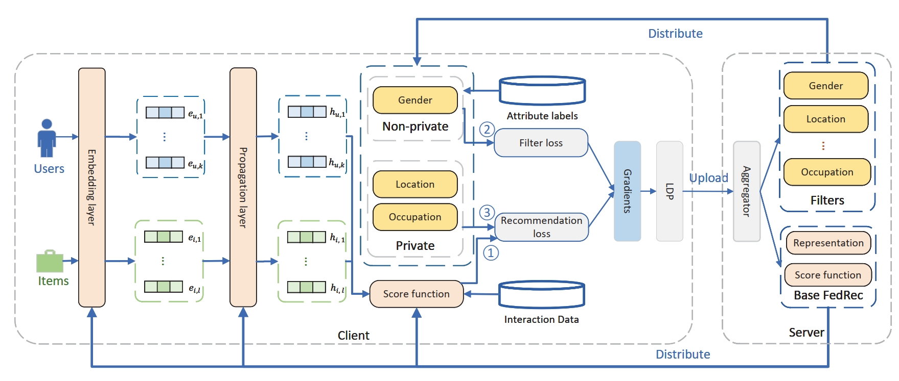

# UC-FedRec
Source Code for WSDM2024 paper "User Consented Federated Recommender System Against Personalized Attribute Inference Attack"


## Introduction
We propose user-consented federated recommender systems (UC-FedRec) against attribute inference attacks to meet the personalized privacy demands of clients. The framework learns a set of attribute information filters to eliminate sensitive information to protect clients' personal attributes from attackers' malicious inferences.



## Reproduction

### Package Dependencies

* numpy
* pandas
* scipy
* scikit-learn == 1.0.2
* torch == 1.7.1
* dgl == 0.6.1

### Data Preparation

Please download the dataset used at [Onedrive](https://hkustconnect-my.sharepoint.com/:u:/g/personal/qhuaf_connect_ust_hk/Eb8tVaBCiXFFpwRtn-pSip8BzNgbGINXzC6cIKEpiaNFzw?e=RomuQ8).

Unzip the file and put it under the root directory of this project.

### Train UC-FedRec

UC-FedRec sample usage at Movielens dataset:

```bash
python main_UC_ML.py --layer_size [128] --batch_size 256 --embed_size 128 --Ks [10] --gpu 3 --lr 0.0001 --model_name sgd_model_run4_1.pkl
```


### Citations
The details of this pipeline are described in the following paper. If you use this code in your work, please kindly cite it.

```bibtex

```

### Miscellaneous

Please send any questions about the code and/or the algorithm to <qhuaf@connect.ust.hk>.
